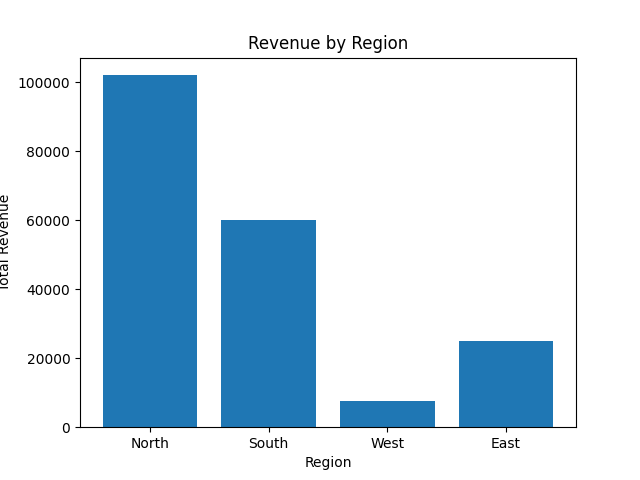

Sales Data Analysis Pipeline (ETL + SQL) Phase 1 Project


An end-to-end data pipeline that extracts sales data (CSV), cleans it with Python (Pandas), and loads it into MySQL for analytics.


Tech Stack

Python (Pandas, SQLAlchemy), MySQL, Matplotlib / Power BI


How to Run

```bash

python src/etl\_runner.py sales\_sample.csv

##  Results

Below is the revenue by region bar chart generated from the MySQL data:




